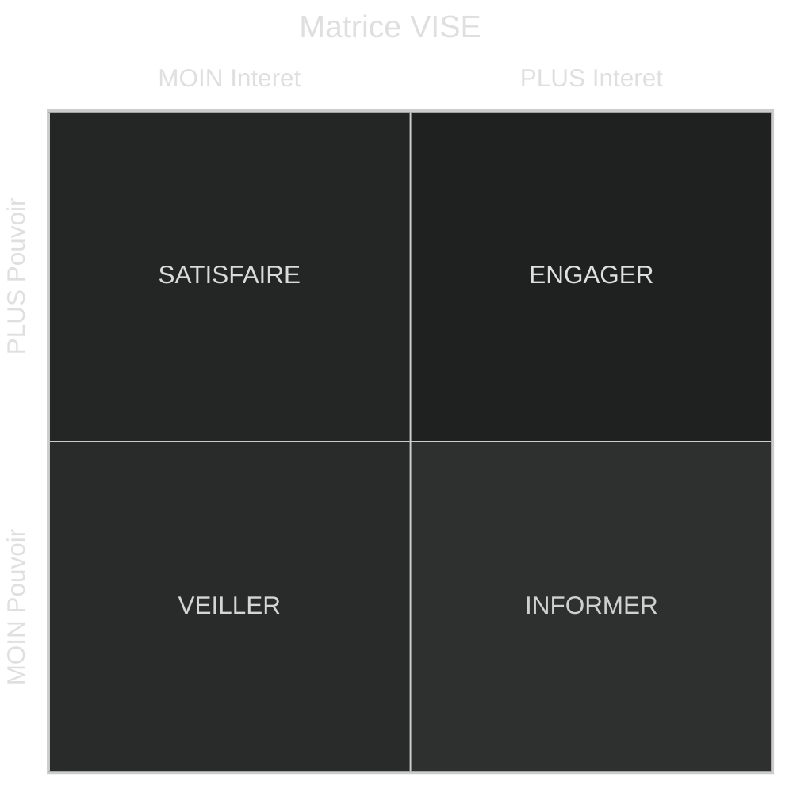

# Introduction

> Cour inérant à tout les coure de management

- [Introduction](#introduction)
  - [Notions](#notions)
    - [Mission](#mission)
    - [Vision](#vision)
    - [Veleurs](#veleurs)
    - [Parties prenantes (stakeholders)](#parties-prenantes-stakeholders)
      - [matrice VISE](#matrice-vise)
- [Annex](#annex)
  - [Remerciment](#remerciment)

## Notions

### Mission

Elle renseigne sur sa raison d’être fondamentale, sa place dans son écosystème et sa spécificité.
Pour qui, pourquoi, sa promesse.

### Vision

Elle renseigne sur son aspiration, son ambition, le futur qu’elle veut dessiner, ce qu’elle veut accomplir.

### Veleurs

Elle indiquent les principes et les pratiques fondamentaux qui régissent sa manière de fonctionner.

- ***Rites et codes*** : Réunions, séminaires, célébrations, pots, dresscode, jargon,…
- ***Tabous*** : Peurs (concurrents), mauvais choix et échecs passés, scandales,…
- ***Mythes et Héros*** : Légendes, histoire du fondateur et des débuts, anecdotes marquantes, coups d’éclats,…

### Parties prenantes (stakeholders)

Ce sont les individus ou un groupe d’individus qui participe ***directement*** ou ***indirectement*** à la vie d’une entreprise, l’***influence*** et/ou est influencé par elle.

#### matrice VISE

Elle nous permettra de cartographie les partie prenante selon son ***statut***, les ***interaction*** avec l'entreprise, ses ***objectif***, de son ***attention*** et de son ***pouvoir*** sur l'entreprise.

Here is a simple flow chart:

# Annex

## Remerciment

Je remarci SIMON Nicolas Professeur à l'IA School en 2024 pour son cour d'introduction au strategie de developpement d'entreprise

<!-- crée par WyloW2RicardO le 2024-03-10 -->