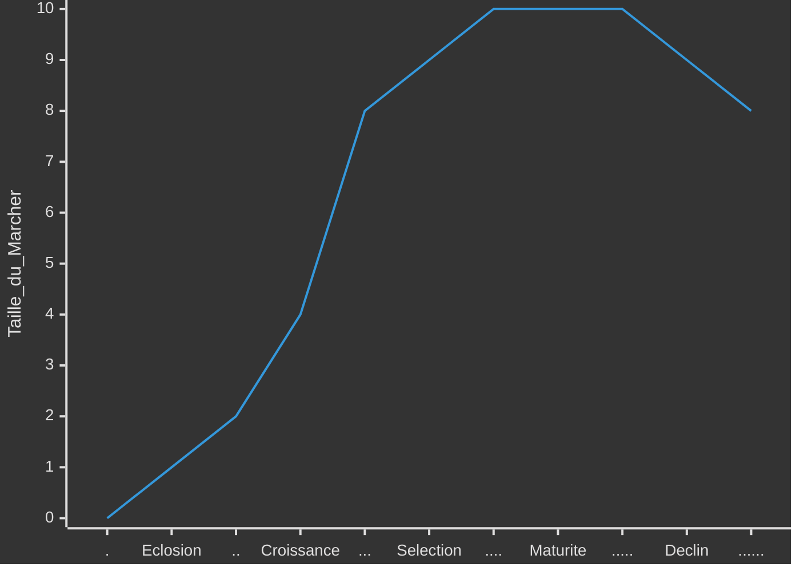

# Strategies des entreprises

> Il sera peut-être préferable de commencé par le cour d'[introdution au management](0-introduction.md)

La **stratégie** d’une entreprise est l’ensemble des ***décisions*** et des actions coordonnées lui permettant d’atteindre ses objectifs ***long terme*** et de lui fournir un ***avantage*** compétitif unique.

Dans ce cour on cherchera à ***identifier*** les risques et opportunités à la rechercher des facteurs de succès valorisés par le marché et dans evaluer le potentiel de croissance et l’attractivité du secteur pour esquisser des stratégies possibles.
>Varier les points de vue avec des avis interne et externe pluridisiplinaire.
Hiérarchiser et Séléctioné les plus pertinantes.

- [Strategies des entreprises](#strategies-des-entreprises)
  - [Diagnostique](#diagnostique)
    - [Externe](#externe)
      - [Macro](#macro)
        - [Théoreme PESTEL](#théoreme-pestel)
      - [Mézo](#mézo)
        - [Structure](#structure)
        - [Cycle de vie](#cycle-de-vie)
      - [Micro](#micro)
        - [6 force de Porteur](#6-force-de-porteur)
    - [Interne](#interne)
  - [Choix](#choix)
    - [Concurence](#concurence)
    - [Croissance](#croissance)
  - [Plan](#plan)
    - [Performance](#performance)
    - [Evaluer](#evaluer)
- [Annex](#annex)
  - [Remerciment](#remerciment)

## Diagnostique

### Externe

#### Macro

les grandes tendances du monde extérieur sur le long terme pouvant influencer l’entreprise.

##### Théoreme PESTEL

determine les principaux facteurs macro qui influencent l’activité.

- **Politique** : Les loi et politiques exercer par les group  (de pression, lobbies, gouvernemental, collectivités) ainsi que leur stabilité.
- **Economique** : Les cout et taux ; croissance, interets, change.
- **Sociétal** : les culture et demographie ; geo, richesse, consomation, éducation, habitudes, éthique.
- **Technologique** : les innovation et infrastructur
- **Ecologie** : la gestion, dévloppement et responsabilité durable
- **Legal** : reglementation

#### Mézo

##### Structure 

- **Monopole** : industrie dominée par ***une*** entreprise avec peut de compétision , un fort pouvoir sur les client.
- **Oligopole** : industrie dominée par ***quelque*** entreprises avec peut de compétision entre eux, un fort pouvoir sur les client et founiseur.
- **Parfaite compétision** : industrie ***non*** dominée avec compétision sur les prix, sans barier.

##### Cycle de vie

- **Eclosion** : innovation et la technologie sont primordiales.
Produits sont différenciés et la concurrence est faible.
Profits sont faibles et les investissements élevés.
- **Croissance** : Marché est vaste et permet une croissance forte.
Les barrières à l’entrée sont faibles, de nouveaux concurrents apparaissent.
Le pouvoir des acheteurs est faible.
- **Séléction** : Marché se sature peu à peu, la croissance ralentit.
Concurrence devient plus intense, les plus forts augmentent leurs profits et les plus faibles disparaissent ou sont absorbés.
- **Maturité** : Marché est saturé et stagne, les barrières à l’entrée sont fortes.
Les produits se standardisent, les profits sont élevés.
Le pouvoir des acheteurs est fort et le prix est primordial.
- **Déclin** : Les acheteurs se détournent peu à peu, le marché décroît.
Le nombre de concurrents diminue, les profits sont encore possibles si situation de monopole ou oligopole.

#### Micro

##### 6 force de Porteur

déterminer si le secteur est attractif et identifier les possibilités stratégiques et leur impact.

- **Concurrence** : Nombre, positions, croissance, cycle de vie, coûts, investissements
- **Entrants** : economies, circuits, Capitaux, Législation, acteurs présents
- **Substitution** :
- **Acheteur** : impacte, leur profits, nécésaire, qualité, leur nombre
- **Fournisseurs** : leur nombre, changement, différent produits
- **Complément** :

### Interne

## Choix

### Concurence

### Croissance

## Plan

### Performance

### Evaluer

# Annex

## Remerciment

Je remarci SIMON Nicolas Professeur à l'IA School en 2024 pour son cour d'introduction au strategie de developpement d'entreprise
<!-- crée par WyloW2RicardO le 2024-03-10 -->