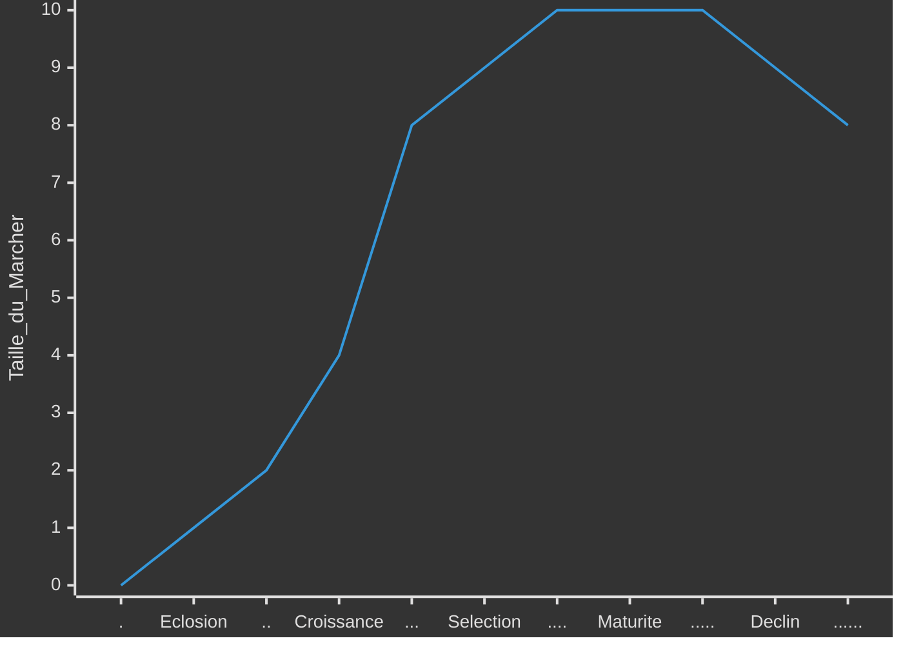
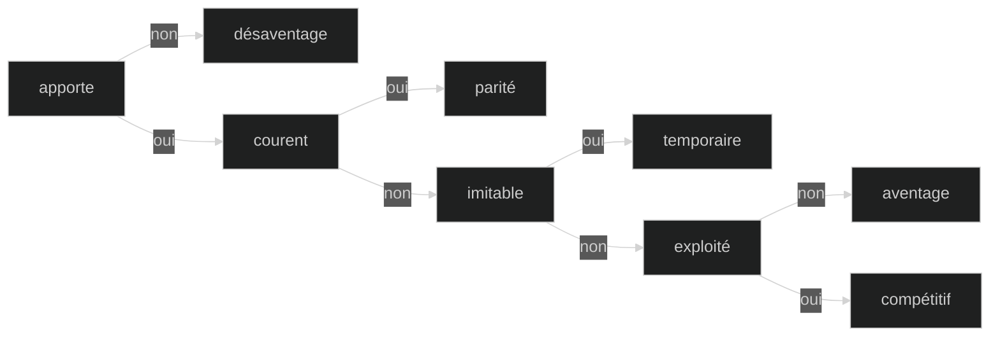
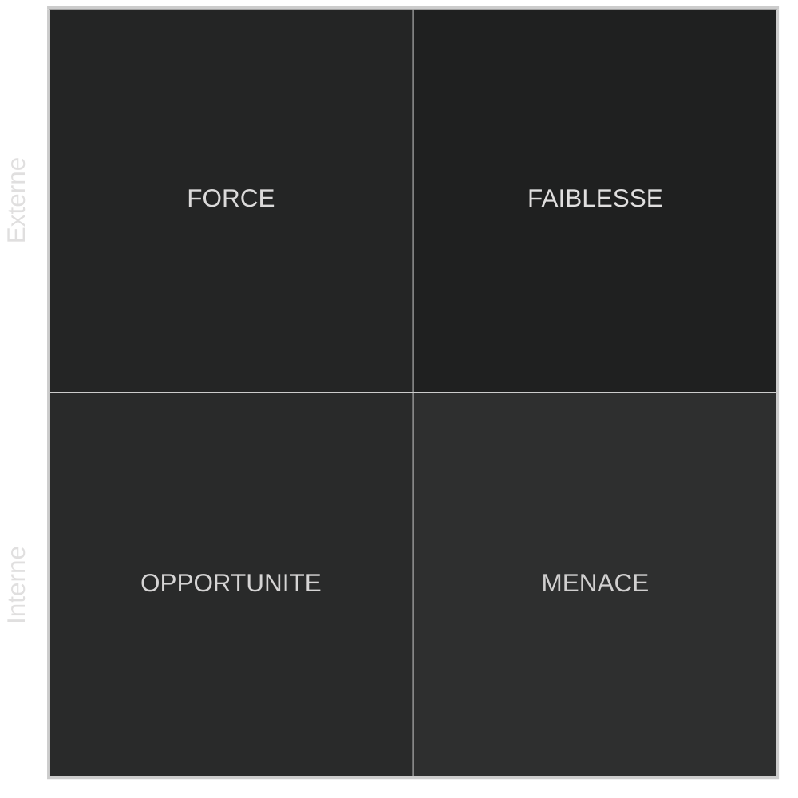
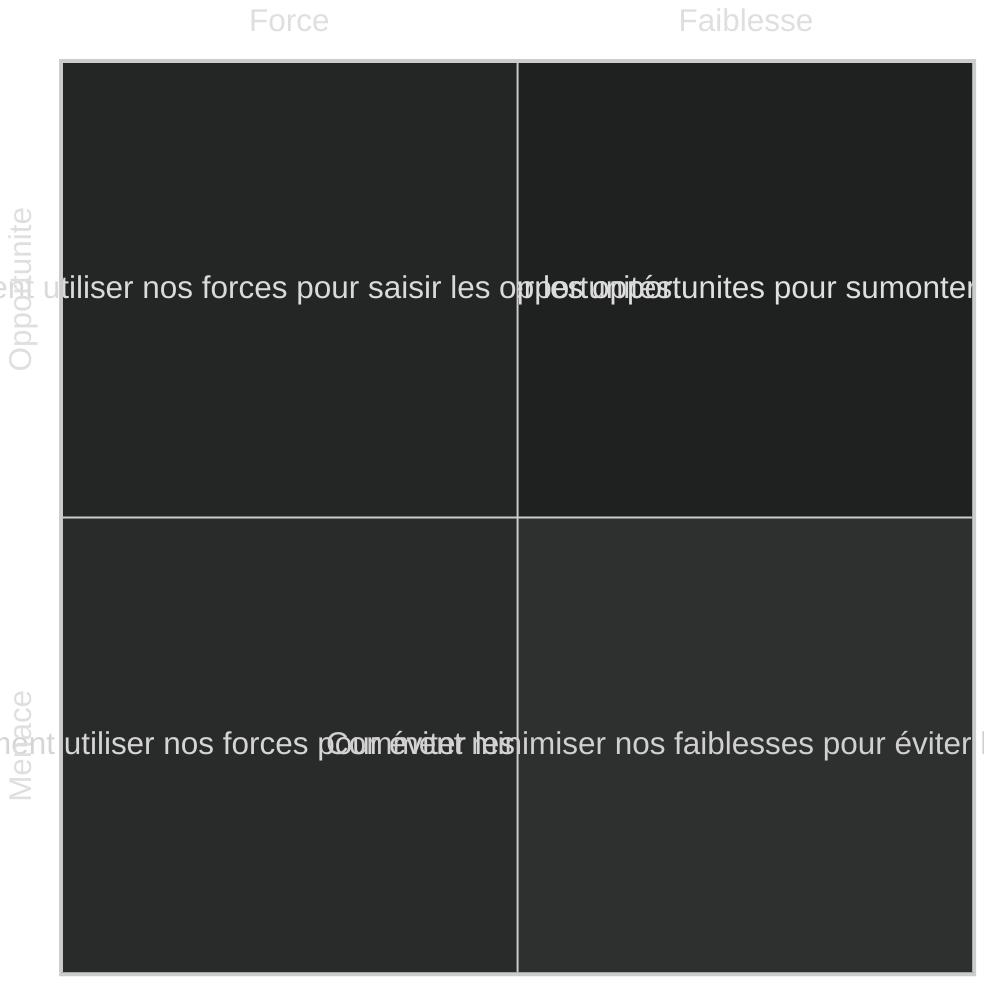
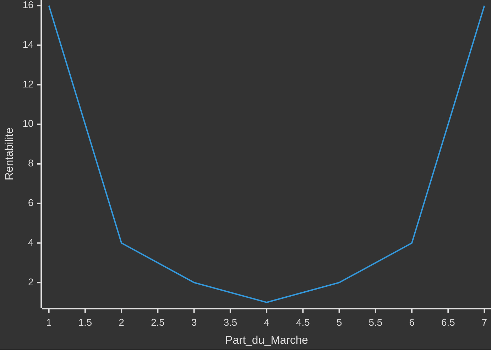

# Strategies des entreprises

> Il sera peut-être préferable de commencé par le cour d'[introdution au management](0-introduction.md)

La **stratégie** d’une entreprise est l’ensemble des ***décisions*** et des actions coordonnées lui permettant d’atteindre ses objectifs ***long terme*** et de lui fournir un ***avantage*** compétitif unique.

Dans ce cour on cherchera à mettre en place des débuts de solution por que l'entreprise se démarque des autres.
>Varier les points de vue avec des avis interne et externe pluridisiplinaire.
Hiérarchiser et Séléctioné les plus pertinantes.

- [Strategies des entreprises](#strategies-des-entreprises)
  - [Diagnostique](#diagnostique)
    - [Externe](#externe)
      - [Macro](#macro)
        - [Théoreme PESTEL](#théoreme-pestel)
      - [Mézo](#mézo)
        - [Structure](#structure)
        - [Cycle de vie](#cycle-de-vie)
      - [Micro](#micro)
        - [6 force de Porteur](#6-force-de-porteur)
    - [Interne](#interne)
      - [Chaine de Valeur](#chaine-de-valeur)
      - [Capacité](#capacité)
        - [Modèle VRIO](#modèle-vrio)
    - [Synthétiser](#synthétiser)
      - [Matrice SWOT](#matrice-swot)
      - [Matrice TOWS](#matrice-tows)
  - [Choix](#choix)
    - [Concurence](#concurence)
      - [3 type de domination](#3-type-de-domination)
        - [Horloge strategique](#horloge-strategique)
      - [Océan](#océan)
        - [Inovation de valeur](#inovation-de-valeur)
      - [Theorie des jeux](#theorie-des-jeux)
    - [Croissance](#croissance)
  - [Plan](#plan)
    - [Performance](#performance)
    - [Evaluer](#evaluer)
      - [Prévition](#prévition)
- [Annex](#annex)
  - [Remerciment](#remerciment)

## Diagnostique

Déterminer la **position stratégique** de l’entreprise et ses choix potentiels.

### Externe

Identifier les ***risques et opportunités*** à la rechercher des **facteurs de succès** valorisés par le marché et dans ***evaluer*** le potentiel de croissance et l’attractivité du secteur pour ***esquisser*** des stratégies possibles.

#### Macro

les grandes tendances du monde extérieur sur le long terme pouvant influencer l’entreprise.

##### Théoreme PESTEL

determine les principaux facteurs macro qui influencent l’activité.

- **Politique** : Les loi et politiques exercer par les group  (de pression, lobbies, gouvernemental, collectivités) ainsi que leur stabilité.
- **Economique** : Les cout et taux ; croissance, interets, change.
- **Sociétal** : les culture et demographie ; geo, richesse, consomation, éducation, habitudes, éthique.
- **Technologique** : les innovation et infrastructur
- **Ecologie** : la gestion, dévloppement et responsabilité durable
- **Legal** : reglementation

#### Mézo

##### Structure

Identifier les structure pour chaque niveaux du [groupe d'activité](0-introduction.md#groupe).

- **Monopole** : industrie dominée par ***une*** entreprise avec peut de compétision , un fort pouvoir sur les client.
- **Oligopole** : industrie dominée par ***quelque*** entreprises avec peut de compétision entre eux, un fort pouvoir sur les client et founiseur.
- **Parfaite compétision** : industrie ***non*** dominée avec compétision sur les prix, sans barier.

##### Cycle de vie

- **Eclosion** : innovation et la technologie sont primordiales.
Produits sont différenciés et la concurrence est faible.
Profits sont faibles et les investissements élevés.
- **Croissance** : Marché est vaste et permet une croissance forte.
Les barrières à l’entrée sont faibles, de nouveaux concurrents apparaissent.
Le pouvoir des acheteurs est faible.
- **Séléction** : Marché se sature peu à peu, la croissance ralentit.
Concurrence devient plus intense, les plus forts augmentent leurs profits et les plus faibles disparaissent ou sont absorbés.
- **Maturité** : Marché est saturé et stagne, les barrières à l’entrée sont fortes.
Les produits se standardisent, les profits sont élevés.
Le pouvoir des acheteurs est fort et le prix est primordial.
- **Déclin** : Les acheteurs se détournent peu à peu, le marché décroît.
Le nombre de concurrents diminue, les profits sont encore possibles si situation de monopole ou oligopole.



#### Micro

##### 6 force de Porteur

déterminer si le secteur est attractif et identifier les possibilités stratégiques et leur impact.

- **Concurrence** : Nombre, positions, croissance, cycle de vie, coûts, investissements
- **Entrants** : economies, circuits, Capitaux, Législation, acteurs présents
- **Substitution** :
- **Acheteur** : impacte, leur profits, nécésaire, qualité, leur nombre
- **Fournisseurs** : leur nombre, changement, différent produits
- **Complément** :

### Interne

Identifier les caractéristiques de l’entreprise pertinentes au regard de son industrie.
Evaluer les ***forces et faiblesses*** de l’entreprise par rapport à ses concurrents.
Déterminer les **capacité distinctif** de l’entreprise.

#### Chaine de Valeur

L’analyse de la chaîne de valeur permet de comprendre et d’**identifier les gisements** de création de valeur au sein de l’entreprise. Elle permet également de calculer le rapport entre la ***valeur apportée*** et le ***coût engendré*** de l'entreprise mais aussi en ***amont et en aval***.
Pour chaque activité de l'entreprise on peut comparer chaque secteur d'activité dans une autre entreprise sans lien necessaire. Pour ***transposer*** les activités performent à son entreprise.[Benchmarking]

```mermaid
%%{init:{'theme':'dark'}}%%
flowchart RL
  subgraph Primaire (direct)
    direction TB
    A[Logistique Amont]
    B[Opération]
    C[Logistique]
    D[Marketing]
    E[Service]
  end
  subgraph Supports (transversal)
    direction TB
    F[Infrastrure]
    G[Ressource Humaines]
    H[Tecnologies]
    I[Achats]
  end
```

#### Capacité

Une foi avoir reccenser les diferentes chaine de valeur, on peut identifier les reél capacité au-dessu du ***seuil*** qui ne ceseras jamais d'augmenter.
Elle contribue à sa pérennité et ***potentiellement*** à créer un avantage compétitif.

- **Ressources** : ***actif tangibles ou intangibles*** qu'elle à disposition. (nom communs)
- **Compétances** : ***procédés*** qui permettent d'exploiter ses ressources. (verbe)

##### Modèle VRIO

On dertermine si caque capacité est strategique

- **Valeur** : capacité qui contribue à la ***création ou réduire*** les cout du produit exploite l'***envirenement*** qui ***apporte*** aux clients.
- **Rareté** : capacité maitrisée par ***trés peu*** de concurent
- **Inimitabilité** : capacité difficile à imiter ou substituer dû à un ***compléxité*** du processus ou infrastrucure complex par l'accumulation de savoir-faire culturel et historique.
- **Organisme** : capacité est correctement ***exploitée***.



### Synthétiser

Les environement externe et interne sont en costante evolution. Pour mintenire un aventage compétitif il faut avoir une **capacité dynamique** en ***réorganiser*** ses activité par l'***anticipation*** des évolution et ***saisir*** les opportunité.

#### Matrice SWOT

Outil pour metre en lumier la ***situation stratégique*** (donnée) par la mise en relation de l'environement externe et interne.



#### Matrice TOWS

Outil pour metre en lumier les ***stratégies possibles*** (piste) par le croisement des rebrique de la matrice SWOT.

<!-- il faut aller à la ligne -->


## Choix

Sur un marché très concurrentiel, il faut prendre en compte les interactions entre compétiteurs et parfois choisir entre compétition et coopération.
Comment croître et assurer sa pérennité ?

### Concurence

La **stratégie concurrentielle** [business strategy]
étudie comment l’entreprise se positionne par rapport à ses concurrents sur ***un marché donné***.
Comment être compétitif sur mon marcher ?

#### 3 type de domination

- **Coût** : avoir les cout les plus bas ;
  - Diminuant les coûts directs,
  - Exploitant des effet d’échelle,
  - Utilisant l’effet d’expérience,
  - Optimisant les produits
  - Optimisant les processus
- **Différentiation** : Valorisation d'un facteur ;
  - Caracteristique
  - Relation
  - Complémentarité
- **Focus** : orientée exclusivement ver un segment de marcher

Pour Porter, l’entreprise doit développer une seule de ces stratégies sur chacun de ses domaines d’activités stratégiques.
Le risque est d'avoir les 2 inconvégnents et donc ne pas avoir une bonne rentabilité



##### Horloge strategique

#### Océan


| Rouge | Bleu |
|-|-|
| Se battre sur un espace de marché | Créer un espace de marché non contesté existant|
| Vaincre les concurrents | Faire perdre toute ***pertinence*** aux concurrents|
| Exploiter une demande existante | Créer et saisir une ***nouvelle demande***|
| Arbitrer entre valeur/coût | Sortir de l’***arbitrage*** valeur/coût|
| Aligner le système entier des activités d’une entreprise sur la poursuite de la différentiation **ET** des coûts bas | Aligner le système entier des activités d’une entreprise sur son choix stratégique différentiation **OU** coûts bas |

Les Océans Bleus créés par des ***acteurs établis*** dans leur coeur de métier Ce qui compte est plutôt l’***avancée stratégique***, la création d’un marché à travers l’***innovation par la valeur*** [value innovation]. ***pas dus uniquement à l’innovation technologique***.

##### Inovation de valeur

C'est la jonction entre la baisse des cout et le resenti de valeur par les clients.

- **Eliminer** les éléments qui n'apporte rien
- **Réduire** les éléments qui amenent un surcout non perçue
- **Elever** les éléments moin exploité pour les clients
- **Créer** de nouveaux élément sur le marcher

#### Theorie des jeux

le gain de chacun dépend des décisions de tous les autres.
La theorie des jeux est un ensemble de concepts pour décrire et prévoir le ***comportement et les interactions*** qui s’influencent mutuellement.
Elle repose sur le postulat que chacun des acteurs va toujours chercher rationnellement à ***maximiser ses gains et minimiser ses pertes***.
Il y a équilibre lorsqu’aucun des joueurs ***ne regrette*** son choix. L’équilibre n’est pas forcément optimal.

### Croissance

La **stratégie de croissance** [corporate strategy]
étudie comment l’entreprise peut se développer
dans d’autres directions (produits, marchés) et par
quels moyens et méthodes.

## Plan

### Performance

### Evaluer

<!-- peut-etre à deplace -->
#### Prévition

- Définir le périmètre [scope] du scénario : quel thème ? quelle durée ?
- Identifier les variables pivots [key drivers] du changement avec leur dépendance, force et incertitude
- Identifier les impacts de chaque scénario et intégrer à la stratégie.
- Développer un récit cohérent à partir d’hypothèses contradictoires en phase avec les mega-tendances [megatrends], identifier les points d’inflexion et leur probabiliter sur le longt terme.
- Confronter régulièrement les scénarios aux développements réels.

# Annex

## Remerciment

Je remarci SIMON Nicolas Professeur à l'IA School en 2024 pour son cour d'introduction au strategie de developpement d'entreprise
<!-- crée par WyloW2RicardO le 2024-03-10 -->