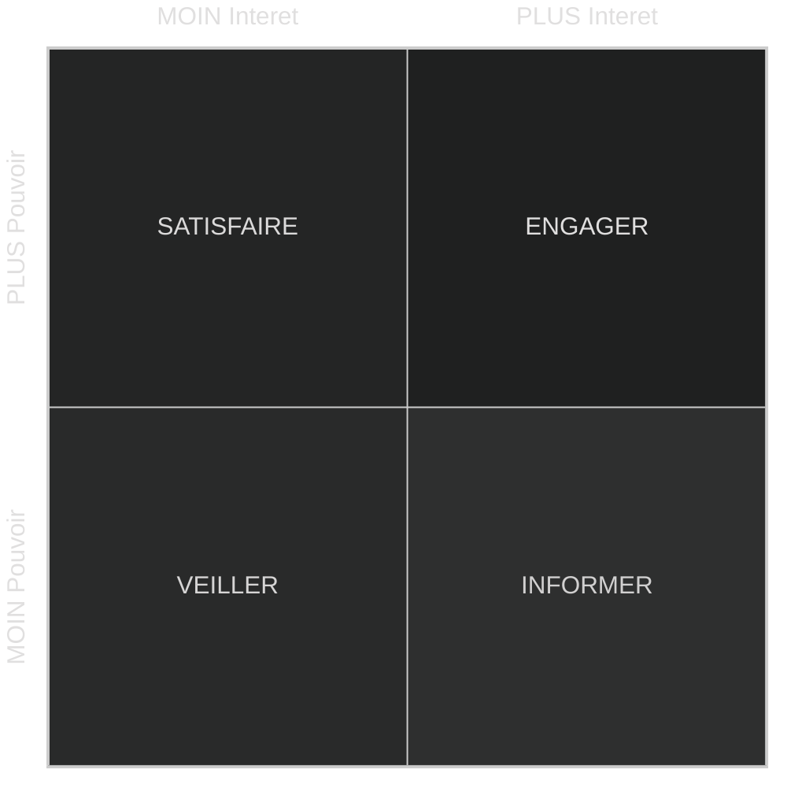

# Introduction

> Cour inérant à tout les coure de management

- [Introduction](#introduction)
  - [L'entreprise](#lentreprise)
    - [Corp](#corp)
  - [Activités](#activités)
    - [Groupe](#groupe)
    - [Parties prenantes (stakeholders)](#parties-prenantes-stakeholders)
      - [Matrice VISE](#matrice-vise)
- [Annex](#annex)
  - [Remerciment](#remerciment)

## L'entreprise

### Corp

- **Mission** : Elle renseigne sur sa raison d’être fondamentale (aspiration), sa place dans son écosystème et sa spécificité.
Pour qui, pourquoi, sa promesse.
- **Vision** : Elle renseigne sur son aspiration, son ambition, le futur qu’elle veut dessiner, ce qu’elle veut accomplir.
- **Veleurs** : Elle indiquent les principes et les pratiques fondamentaux qui régissent sa manière de fonctionner. C'est se qui permet le tavaille d'equipe.
  - ***Rites et codes*** : Réunions, séminaires, célébrations, pots, dresscode, jargon,…
  - ***Tabous*** : Peurs (concurrents), mauvais choix et échecs passés, scandales,…
  - ***Mythes et Héros*** : Légendes, histoire du fondateur et des débuts, anecdotes marquantes, coups d’éclats,…

## Activités

### Groupe

- **Secteur d'activité** [industry] : ensemble d'entreprise offrant produits et services comparable et globalement sustituable.
- **Group strategique** : ensemble d’entreprises d’un même secteur d’activité ayant des stratégies et caractéristiques semblables et s’appuyant sur les mêmes facteurs de concurrence.
- **Marché** : ensemble de clients de produits ou services spécifiques ayant des caractéristiques similaires.
Lieu de rencontre entre l’offre et la demande.

### Parties prenantes (stakeholders)

Ce sont les individus ou un groupe d’individus qui participe ***directement*** ou ***indirectement*** à la vie d’une entreprise, l’***influence*** et/ou est influencé par elle.

#### Matrice VISE

Elle nous permettra de cartographie les partie prenante selon son ***statut***, les ***interaction*** avec l'entreprise, ses ***objectif***, de son ***attention*** et de son ***pouvoir*** sur l'entreprise.

<!-- les entete sont coupé -->

# Annex

## Remerciment

Je remarcis SIMON Nicolas Professeurs à l'IA School en 2024 pour son cour d'introduction au [strategie d'entreprise](2-strategies.md)
Je remerci BALAGUER Raphaël Professeur à l'IA School en 2024 pour son cour sur d'introduction au [business model](1-business.md) d'entreprise

<!-- crée par WyloW2RicardO le 2024-03-10 -->