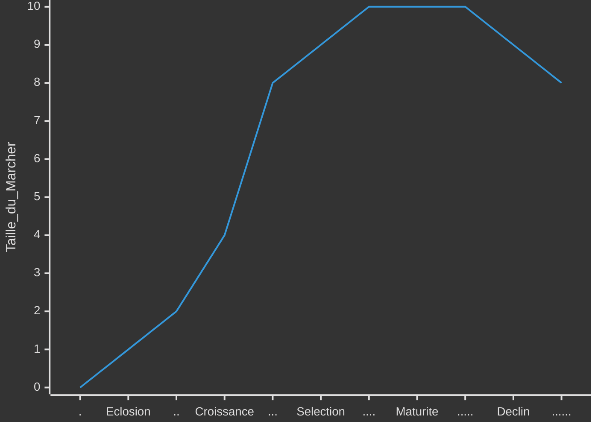
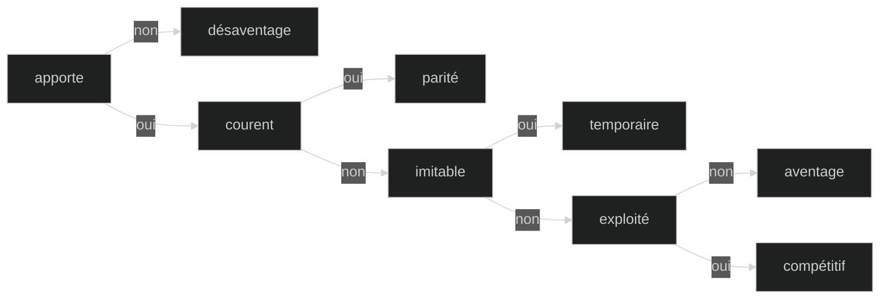
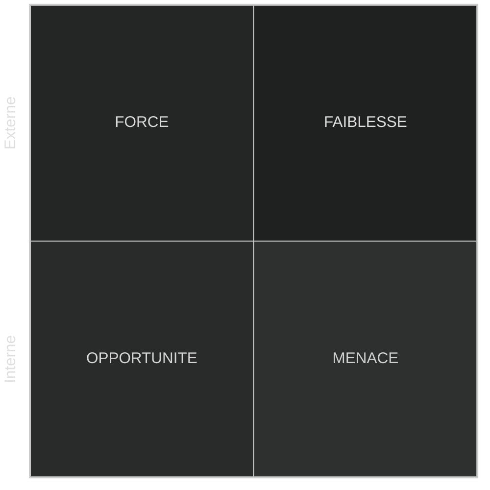
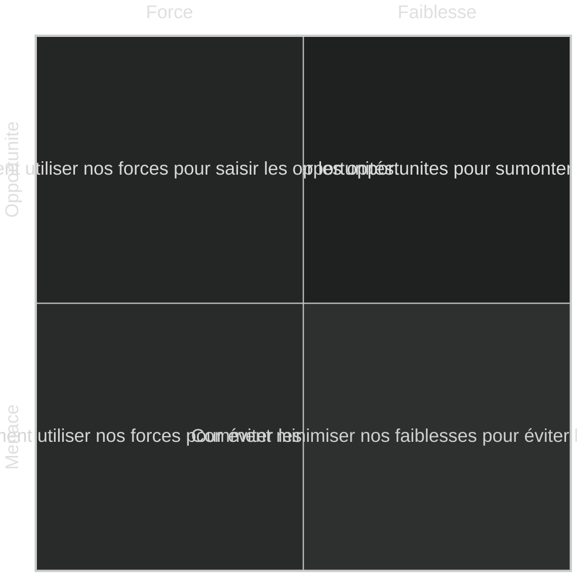
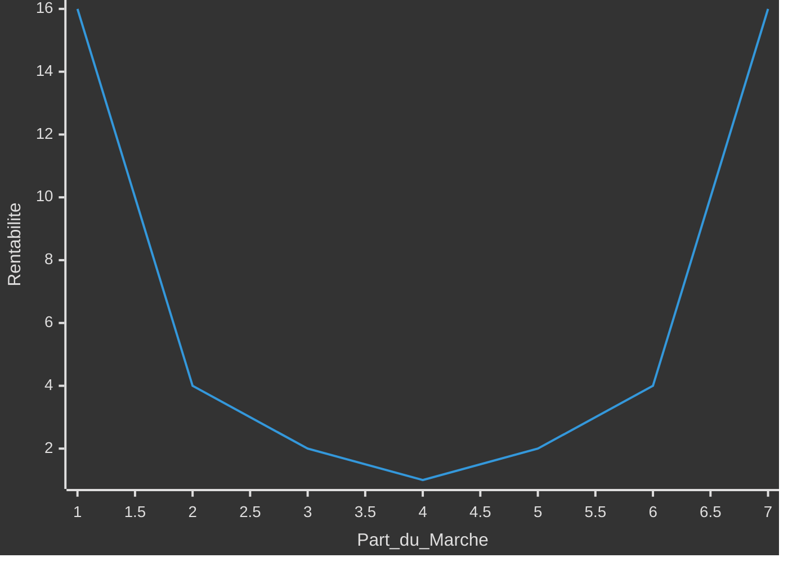
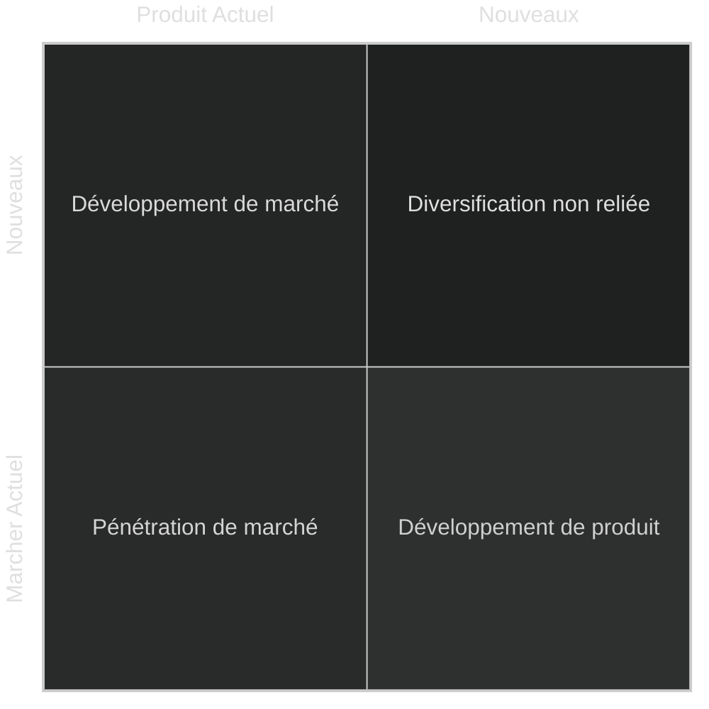
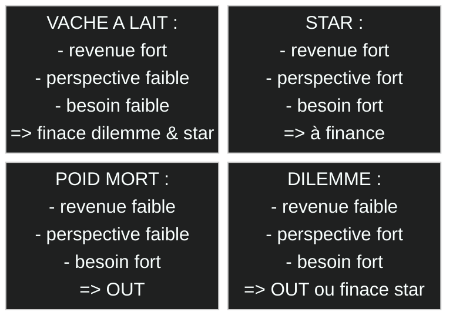

# Strategies des entreprises

> Il sera peut-être préferable de commencé par le cour d'[introdution au management](0-introduction.md)

La **stratégie** d’une entreprise est l’ensemble des ***décisions*** et des actions coordonnées lui permettant d’atteindre ses objectifs ***long terme*** et de lui fournir un ***avantage*** compétitif unique.

Dans ce cour on cherchera à mettre en place des débuts de solution por que l'entreprise se démarque des autres.
>Varier les points de vue avec des avis interne et externe pluridisiplinaire.
Hiérarchiser et Séléctioné les plus pertinantes.

- [Strategies des entreprises](#strategies-des-entreprises)
  - [Diagnostique](#diagnostique)
    - [Externe](#externe)
      - [Macro](#macro)
        - [Théoreme PESTEL](#théoreme-pestel)
      - [Mézo](#mézo)
        - [Structure](#structure)
        - [Cycle de vie](#cycle-de-vie)
      - [Micro](#micro)
        - [6 force de Porteur](#6-force-de-porteur)
    - [Interne](#interne)
      - [Chaine de Valeur](#chaine-de-valeur)
      - [Capacité](#capacité)
        - [Modèle VRIO](#modèle-vrio)
    - [Synthétiser](#synthétiser)
      - [Matrice SWOT](#matrice-swot)
      - [Matrice TOWS](#matrice-tows)
  - [Choix](#choix)
    - [Concurence](#concurence)
      - [3 type de domination](#3-type-de-domination)
        - [Horloge strategique](#horloge-strategique)
      - [Océan](#océan)
        - [Inovation de valeur](#inovation-de-valeur)
      - [Theorie des jeux](#theorie-des-jeux)
    - [Croissance](#croissance)
      - [Voie](#voie)
        - [Matrice d'Ansoff](#matrice-dansoff)
        - [Internationalisation](#internationalisation)
        - [Integration](#integration)
      - [Mode](#mode)
        - [Intreprenariat](#intreprenariat)
        - [Acquisitions](#acquisitions)
      - [Porteufeuil d'activité](#porteufeuil-dactivité)
        - [Matrice BCG](#matrice-bcg)
        - [Matrice ADL](#matrice-adl)
        - [Matrce Mckinsey](#matrce-mckinsey)
        - [Aventage](#aventage)
  - [Plan](#plan)
    - [Performance](#performance)
    - [Evaluer](#evaluer)
      - [Prévition](#prévition)
- [Annex](#annex)
  - [Remerciment](#remerciment)

## Diagnostique

Déterminer la **position stratégique** de l’entreprise et ses choix potentiels.

### Externe

Identifier les ***risques et opportunités*** à la rechercher des **facteurs de succès** valorisés par le marché et dans ***evaluer*** le potentiel de croissance et l’attractivité du secteur pour ***esquisser*** des stratégies possibles.

#### Macro

les grandes tendances du monde extérieur sur le long terme pouvant influencer l’entreprise.

##### Théoreme PESTEL

determine les principaux facteurs macro qui influencent l’activité.

- **Politique** : Les loi et politiques exercer par les group  (de pression, lobbies, gouvernemental, collectivités) ainsi que leur stabilité.
- **Economique** : Les cout et taux ; croissance, interets, change.
- **Sociétal** : les culture et demographie ; geo, richesse, consomation, éducation, habitudes, éthique.
- **Technologique** : les innovation et infrastructur
- **Ecologie** : la gestion, dévloppement et responsabilité durable
- **Legal** : reglementation

#### Mézo

##### Structure

Identifier les structure pour chaque niveaux du [groupe d'activité](0-introduction.md#groupe).

- **Monopole** : industrie dominée par ***une*** entreprise avec peut de compétision , un fort pouvoir sur les client.
- **Oligopole** : industrie dominée par ***quelque*** entreprises avec peut de compétision entre eux, un fort pouvoir sur les client et founiseur.
- **Parfaite compétision** : industrie ***non*** dominée avec compétision sur les prix, sans barier.

##### Cycle de vie

- **Eclosion** : innovation et la technologie sont primordiales.
Produits sont différenciés et la concurrence est faible.
Profits sont faibles et les investissements élevés.
- **Croissance** : Marché est vaste et permet une croissance forte.
Les barrières à l’entrée sont faibles, de nouveaux concurrents apparaissent.
Le pouvoir des acheteurs est faible.
- **Séléction** : Marché se sature peu à peu, la croissance ralentit.
Concurrence devient plus intense, les plus forts augmentent leurs profits et les plus faibles disparaissent ou sont absorbés.
- **Maturité** : Marché est saturé et stagne, les barrières à l’entrée sont fortes.
Les produits se standardisent, les profits sont élevés.
Le pouvoir des acheteurs est fort et le prix est primordial.
- **Déclin** : Les acheteurs se détournent peu à peu, le marché décroît.
Le nombre de concurrents diminue, les profits sont encore possibles si situation de monopole ou oligopole.



#### Micro

##### 6 force de Porteur

déterminer si le secteur est attractif et identifier les possibilités stratégiques et leur impact.

- **Concurrence** : Nombre, positions, croissance, cycle de vie, coûts, investissements
- **Entrants** : economies, circuits, Capitaux, Législation, acteurs présents
- **Substitution** :
- **Acheteur** : impacte, leur profits, nécésaire, qualité, leur nombre
- **Fournisseurs** : leur nombre, changement, différent produits
- **Complément** :

### Interne

Identifier les caractéristiques de l’entreprise pertinentes au regard de son industrie.
Evaluer les ***forces et faiblesses*** de l’entreprise par rapport à ses concurrents.
Déterminer les **capacité distinctif** de l’entreprise.

#### Chaine de Valeur

L’analyse de la chaîne de valeur permet de comprendre et d’**identifier les gisements** de création de valeur au sein de l’entreprise. Elle permet également de calculer le rapport entre la ***valeur apportée*** et le ***coût engendré*** de l'entreprise mais aussi en ***amont et en aval***.
Pour chaque activité de l'entreprise on peut comparer chaque secteur d'activité dans une autre entreprise sans lien necessaire. Pour ***transposer*** les activités performent à son entreprise.[Benchmarking]

```mermaid
%%{init:{'theme':'dark'}}%%
flowchart RL
  subgraph Primaire (direct)
    direction TB
    A[Logistique Amont]
    B[Opération]
    C[Logistique]
    D[Marketing]
    E[Service]
  end
  subgraph Supports (transversal)
    direction TB
    F[Infrastrure]
    G[Ressource Humaines]
    H[Tecnologies]
    I[Achats]
  end
```

#### Capacité

Une foi avoir reccenser les diferentes chaine de valeur, on peut identifier les reél capacité au-dessu du ***seuil*** qui ne ceseras jamais d'augmenter.
Elle contribue à sa pérennité et ***potentiellement*** à créer un avantage compétitif.

- **Ressources** : ***actif tangibles ou intangibles*** qu'elle à disposition. (nom communs)
- **Compétances** : ***procédés*** qui permettent d'exploiter ses ressources. (verbe)

##### Modèle VRIO

On dertermine si caque capacité est strategique

- **Valeur** : capacité qui contribue à la ***création ou réduire*** les cout du produit exploite l'***envirenement*** qui ***apporte*** aux clients.
- **Rareté** : capacité maitrisée par ***trés peu*** de concurent
- **Inimitabilité** : capacité difficile à imiter ou substituer dû à un ***compléxité*** du processus ou infrastrucure complex par l'accumulation de savoir-faire culturel et historique.
- **Organisme** : capacité est correctement ***exploitée***.



### Synthétiser

Les environement externe et interne sont en costante evolution. Pour mintenire un aventage compétitif il faut avoir une **capacité dynamique** en ***réorganiser*** ses activité par l'***anticipation*** des évolution et ***saisir*** les opportunité.

#### Matrice SWOT

Outil pour metre en lumier la ***situation stratégique*** (donnée) par la mise en relation de l'environement externe et interne.



#### Matrice TOWS

Outil pour metre en lumier les ***stratégies possibles*** (piste) par le croisement des rebrique de la matrice SWOT.

<!-- il faut aller à la ligne -->


## Choix

Comment croître et assurer sa pérennité ?

- **stratégie de croissance** : étudie comment l’entreprise peut se développer dans d’autres ***directions*** (produits, marchés) et par quels moyens et méthodes.
Création de synergie entre les activités

- **stratégie concurrentielle** : étudie comment l’entreprise se positionne par rapport à ses concurrents sur ***un marché donné***.

### Concurence

Sur un marché très concurrentiel, il faut prendre en compte les interactions entre compétiteurs et parfois choisir entre ***compétition et coopération***.
Comment être compétitif sur mon marcher ?

#### 3 type de domination

- **Coût** : avoir les cout les plus bas ;
  - Diminuant les coûts directs,
  - Exploitant des effet d’échelle,
  - Utilisant l’effet d’expérience,
  - Optimisant les produits
  - Optimisant les processus
- **Différentiation** : Valorisation d'un facteur qui justifie un prix plus élévation ;
  - Caracteristique
  - Relation
  - Complémentarité
- **Focus** : orientée exclusivement ver un segment de marcher

Pour Porter, l’entreprise doit développer une seule de ces stratégies sur chacun de ses domaines d’activités stratégiques.
Le risque est d'avoir les 2 inconvégnents et donc ne pas avoir une bonne rentabilité



##### Horloge strategique

#### Océan

| Rouge | Bleu |
|-|-|
| Se battre sur un espace de marché | Créer un espace de marché non contesté existant|
| Vaincre les concurrents | Faire perdre toute ***pertinence*** aux concurrents|
| Exploiter une demande existante | Créer et saisir une ***nouvelle demande***|
| Arbitrer entre valeur/coût | Sortir de l’***arbitrage*** valeur/coût|
| Aligner le système entier des activités d’une entreprise sur la poursuite de la différentiation **ET** des coûts bas | Aligner le système entier des activités d’une entreprise sur son choix stratégique différentiation **OU** coûts bas |

Les Océans Bleus créés par des ***acteurs établis*** dans leur coeur de métier Ce qui compte est plutôt l’***avancée stratégique***, la création d’un marché à travers l’***innovation par la valeur*** [value innovation]. ***pas dus uniquement à l’innovation technologique***.

##### Inovation de valeur

C'est la jonction entre la baisse des cout et le resenti de valeur par les clients.

- **Eliminer** les éléments qui n'apporte rien
- **Réduire** les éléments qui amenent un surcout non perçue
- **Elever** les éléments moin exploité pour les clients
- **Créer** de nouveaux élément sur le marcher

#### Theorie des jeux

Le gain de chacun dépend des décisions de tous les autres.
La theorie des jeux est un ensemble de concepts pour décrire et prévoir le ***comportement et les interactions*** qui s’influencent mutuellement.
Elle repose sur le postulat que chacun des acteurs va toujours chercher rationnellement à ***maximiser ses gains et minimiser ses pertes***.
Il y a équilibre lorsqu’aucun des joueurs ***ne regrette*** son choix. L’équilibre n’est pas forcément optimal.

### Croissance

quelles [groupe d'activité](1-introduction.md#groupe) l’entreprise doit-elle se développer ?
dévloppé de nouveaux produit ou marché
faire de façon interne ou extene
géré un portefeuille d'activité

#### Voie

La **Spécialisation** : en [phase](#cycle-de-vie) d'***eclosion ou croissance***.
La **Diversification** : en phase de ***maturité ou déclin***

- Nouveaux **produit** :  vente de nouveaux produit pour ses prospet actuel par la ***complémentarité***.
  - Aventage
    - Connaissance des marchés et des clients
    - Acquisition de nouvelles compétences
    - Synergies avec produits existants
    - Gestion de cycles de vie produits dissociés
    - Retours d’expérience utilisables pour les produits et services existants
    - Effets d’échelle
  - Inconvenients
    - Coûts de développement élevés
    - Risques projets
    - Compétences difficiles à acquérir
    - Facteurs clés de succès différents
    - Confrontation avec de nouveaux concurrents
    - Gestion et organisation plus complexe
    - Changement de culture
- Nouveaux **marchés** : trouver aux produits de ***nouveaux usages et d’utilisateurs*** par une extension géographique. L’entreprise doit apprendreà se familiariser d’autres ***cultures***.
  - Aventage
    - Maîtrise des produits et services
    - Acquisition de nouveaux savoirs marchés
    - “Tête de pont” pour d’autres produits
    - Retours d’expérience utilisables pour les marchés existants, enrichissement culturel
    - Répartition des risques marchés / pays
    - Effets d’échelle
  - Inconvenients
    - Coûts d’implantation élevés
    - Différences clés de succès, culturelles, politiques, légales,...
    - Nouveaux et enciens concurrents
    - coordination plus complexe

##### Matrice d'Ansoff



> - Pénétration de marché : vente de produit exitant pour ses prospet actuel ; on vise à acroire les ventes en fidélisant les clients pour augmenté sa part de marcher.
>   - Aventage
>     - capasiter déjà en place
>     - mise ne oeuvre rapide
>     - effet d'experience
>     - pouvoir accru sur acheteur et fourniseur
>     - risque connus et limité
>     - pas de cout dvpt produit
>   - Inconvenients
>     - obsoléscent des produits
>     - Durcissement de la concurrence
>     - Baisse des prix et de la rentabilité
>     - Étroitesse ou baisse du marché
>     - Pas d’acquisition de nouvelles compétences
>     - regulation

##### Internationalisation

La recherche d’économies d’échelle, de coûts de production locaux plus faibles, ou de volumes de vente plus importants du besoins clients similaires à ceux du pays d’origine est également une motivation pour  internationaliser ses activités.

- **Export** : Expédie ses produits depuis son pays et utilise un réseau de distribution local.
- **License / Franchise** : accord contractuel permettant à un  partenaire local d’utiliser la technologie / la marque.
- **Joint venture** : l’entreprise et un partenaire local sont co-actionnaires.
- **Filiale** : création ou rachat d’une entité locale détenue à 100% par  l’entreprise.

##### Integration

Une voie de diversification stratégique consiste à intégrer des activités appartenant à la ***même chaîne de valeur***.

- Vertical :
  - Aventage
    - Connaissance du secteur d’activité
    - Connaissance des clients finaux
    - Augmentation de la valeur ajoutée
    - Pouvoir accru sur les acheteurs ou fournisseurs restants (contrebaliser les forces)
    - Sécurité de l’approvisionnement (amont) ou de la distribution (aval)
    - Cible connue
    - Préssion sur les concurents
  - Inconvenients
    - Différents facteurs clés de succès
    - Compétences et ressources requises différentes
    - Rétorsion de la part des clients ou fournisseurs concurrencés
    - Perte de clients et/ou fournisseurs
    - Concentration du risque marché
    - Rentabilité des activités amont / aval potentiellement plus faiblexe
- Horisontal
  - Aventage
    - Compétences et ressources requises proches, synergies et effets d’échelle
    - Technologies croisées  Pouvoir accru sur fournisseurs si synergies achats entre activités
    - Acquisition de nouveaux clients
    - Repartition du risque
  - Inconvenients
    - Diférent clés de succès, client et secteur d'activité
    - Dilution des ressource
    - Compléxité suplémentaire
    - Nouveaux concurent

#### Mode

L’entreprise peut décider de compter sur ses ***capacités actuelles*** en les développant et ainsi choisir la croissance interne ou la croissance externe et ***acquérir*** de nouvelles ressources et compétences.

##### Intreprenariat

- avantages
  - Coût initial plus faible
  - Investissement plus régulier
  - Recul ou abandon plus facile
  - Apprentissage et expérience
  - Fort outil de motivation...si réussi !
  - Indépendance conservée
  - Décision rapide, processus maîtrisé (arret possible)
- inconvénients
  - Résultats plus longs à obtenir
  - Effort pour recréer la chaîne de valeur
  - Peut revenir plus cher à long terme
  - Dilution des ressources existantes
  - Peu adapté aux changements radicaux
  - Désorganisation et démotivation si échec ou stagnation
  - Risque de l’entre-soi

##### Acquisitions

- avantages
  - Economies d’échelle potentielles (synergies et redondances)
  - Bénéfice immédiat de la position marché existante de la cible
  - Résultats réels connus et tangibles
  - Acquisition de technologies de rupture, de compétences rares
  - Echanges de bonnes pratiques
- inconvénients
  - Fonds nécessaires importants
  - Soumis à l’acceptation de la cible
  - Processus d’acquisition long et incertain
  - Peut être soumis à accord des autorités
  - Cultures d’entreprise différentes
  - Historique de concurrence avec cible
  - Risques sociaux
  - Difficultés d’intégration
  - Dilution de valeur

#### Porteufeuil d'activité

Prendre des décisions stratégiques concernant l’***allocation des ressources***, le renforcement, le désengagement ou la cession de chaque DAS (Domaine d’Activité Stratégique).

##### Matrice BCG

Determiner l'attractivité et l'équilibre d'un portefeuille d'activité

- **Croissance du marché** (abscisse) : par rapport à la ***croissance économique moyenne*** ou le degré de maturité de l’industrie.
- **Part de marché relative** (ordonnée) : part de marché de l’entreprise sur le concurrent principal
- **Poids du DAS** dans le CA de l’entreprise en % (taille de la bulle)



Ainsi les "vache à lait" qui gener l'argent de magner efficient permet de finacer les "dilemmes" pour qu'il devient des "stars" qui à long terme deviendra des vache à lait. Les ***risques*** financiers, sectoriels
et concurrentiels sont ***minimisés*** et répartis. (cercle vertueu)

##### Matrice ADL

Matrice dynamique qui intègre le ***cycle de vie*** du secteur d’activité. Selon la ***phase de maturité*** du secteur et la position concurrentielle du DAS, chaque DAS peut se trouver dans une des 3 zones stratégiques.

- **Naturel** : Le DAS est en bonne position concurrentielle et a des perspectives de marché prometteuses.
L’entreprise doit accompagner son développement.
- **Sélection** : L’entreprise doit choisir entre les différents DAS les plus prometteurs et investir pour améliorer leur rentabilité.
- **Abandon** : L’entreprise doit désinvestir ou céder les DAS de cette zone.

##### Matrce Mckinsey

Permet d’aller ***plus loin que la BCG*** en diversifiant les critères, selon l'attrait et ses atouts.

- **Attrait de l’activité**
  - Taille et taux de croissance du marché
  - Rentabilité du secteur
  - [Intensité concurrentielle](#6-force-de-porteur)
  - [Risques et opportunités](#externe)
- **Atouts de l’entreprise**
  - Qualité des produits et services
  - [Capacité distinctives](#capacité)
  - [Forces et Faiblesses](#interne)

##### Aventage

- Un portefeuille **équilibré** est situation favorable pour l’entreprise pour prendre des décisions stratégiques.
- L’entreprise **diversifiée** doit gérer plusieurs activités pas nécessairement reliées entre elles.
- La **holding** peut apporter de la valeur à l’ensemble en :
  - fournissant la ***vision*** et la ***stratégie***
  - facilitant les ***synergies*** entre activités
  - développant les compétences des ***managers***
  - offrant des ***services centraux***, des ressources artagées, du conseil interne
  - contrôlant la ***performance*** des activités et prenant les actions correctives si nécessaires.

## Plan

### Performance

fond propres : batiment, 
obsolution : evolution maintenace
2 petit en cas de panne 
former pour objectif com pour toucher plus pour augmenter benef
effort marketing agment vente prod plus marge
antagoniste, contradictoire reformuler ou verifier
pas trop ni trop peux pour donné envie car elle peut arriver trop top ou pas du tout
smart max 1an

### Evaluer

outil aide désition enrichier les desition
pertinace croiser les option strategique avec le swot
acc risk : quelle retenu de l'investisment
classic "rasionel en tout etat de cause"
limité : pas tout conetre et jamais rationnel
donc plusieur limité bier congnitive et diluer les prise de désition
delibérér "decider d'en haut"
emergent : utile ou nécésaire

<!-- peut-etre à deplace -->
#### Prévition

- Définir le périmètre [scope] du scénario : quel thème ? quelle durée ?
- Identifier les variables pivots [key drivers] du changement avec leur dépendance, force et incertitude
- Identifier les impacts de chaque scénario et intégrer à la stratégie.
- Développer un récit cohérent à partir d’hypothèses contradictoires en phase avec les mega-tendances [megatrends], identifier les points d’inflexion et leur probabiliter sur le longt terme.
- Confronter régulièrement les scénarios aux développements réels.

## Annex

### Remerciment

Je remarci SIMON Nicolas Professeur à l'IA School en 2024 pour son cour d'introduction au strategie de developpement d'entreprise
<!-- crée par WyloW2RicardO le 2024-03-10 -->
