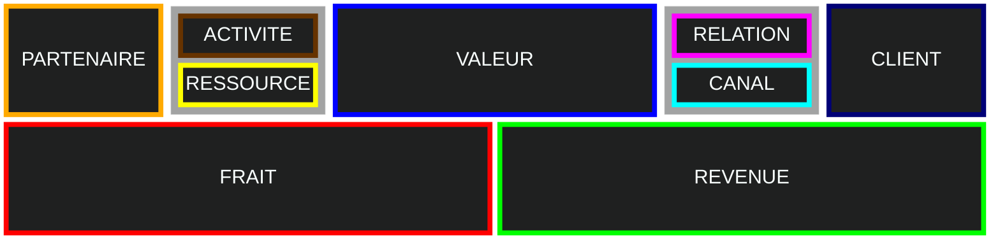
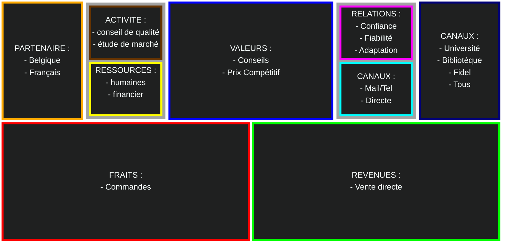

# Business

L'aboutissement d'un reve passe par la création de valeur ; la somme de tout les création de valeur donne le PIB.
Il à donc besion d'un plan structurer pour l'esplication

- [Business](#business)
  - [Etude du Marché](#etude-du-marché)
    - [Environement](#environement)
    - [Client](#client)
  - [Model d'affaires](#model-daffaires)
    - [Strategie](#strategie)
      - [Déstruction Créatice](#déstruction-créatice)
      - [Distinction](#distinction)
      - [Recherche](#recherche)
      - [Evaluer](#evaluer)
    - [Presentation Canva](#presentation-canva)
  - [Plan](#plan)
  - [Financier](#financier)
- [Annex](#annex)
  - [Exemple](#exemple)
    - [Business inovant](#business-inovant)
    - [Librairie](#librairie)
  - [Remerciment](#remerciment)

## Etude du Marché

L'etude du marcher servira a connaitre l'environement et les prospet.
Assurer vous que chaque ***proposition de [valeur](1-introduction.md#lentreprise)*** corespont au besoin de vos prospet que vous avez interoger selon la segmentation choisie.
Il faut avoir des connaissance approfondie du marché par la colecte de donnés (***valide et realiste***).

### Environement

- **Carateristique** produit :
- **Utilié** : efficasité
- **Valeur ajouté** : qulité-prix
- **Avantage** : prix
- **Strategie** :
  
### Client

Sa prosperité est lier à sa clientèle, il donc important de bien la conaitre ; masse, niche, diversifié, local.

- **Prospet** : determiner le profile type
- **Résoudre** : problemme ou besoins à satisfaire
- **Choix** : la raison qu'ils vous choisisse plutot qu'un autre
  
## Model d'affaires

il occupe une place central pour la création entreprise,
il aide à definir les differents ***mecanismes*** de l'entreprise mais aussi etudier les ***interactions*** pour gagner un temps précieux.
Il recouvre la façon dr géré les revenu et les besoin à long terme.

### Strategie

Rien se passe comme prévue, vous pouver etre rapidement submerger alors garder votre [vision](0-introduction.md#lentreprise) en tete pour ***identifier les prioriter*** dans vos objectifs à long terme (pour vous et vos partenaire).
Pour quoi elle va exister, ou elle va et comment et s'y ***adapter sans cesse*** votre vision et objectif.

- **Pour quoi** : sa raison d'être, ce quelle ***propose*** au monde
- **Comment** : les ***finalité*** pratique ; outils,resources
- **Vie** : le lien entre la vie perso et pro doit etre en ***acord***.

On cherche à construire nouvel ***courbe de valeur*** pour certain atribue.
***Remettre en cause*** la logique dominate sur les valeurs ou l'archictecture et ***anticiper*** les affiliations tecnologies.
On peut identifier le **besoin fondamental** (laten, non exprimé) qui peut faire prendre conscience de la sophication actuel inutile.

#### Déstruction Créatice

Création de ***nouveaux*** moyen mis à son profit de nouvelle regle du jeu détruisant l'odre établie lui donant un ***monopole de profi***, c'est l'approche Schumpetérienne
Elles peuvent etre facillement copier mais permet de prendre de l'avance qui peut etre ***mintenue***

#### Distinction

Une distincion peut aussi etre utilisé pour ***reduir les couts*** et amplifier l'achitecture de ***valeur***.

- Inovation : une question de technologie
  - **incremental** : inovation du au progres ***naturel***
  - **radial** : modifie ***profondément*** les réferences
- Strategique :
  - **Continuité** : nouvel proposition en lien pour ***renforcer*** le model.
  - **Disruptive** : ***destabiliser*** le marcher par une ofre plus accécible et facile par un nouveau model

#### Recherche

les facteur compétitive

- **Techno push** : endogénes et radical ; théorie des ressources par les ingénieurs
- **Market pull** : exogenes et latent ; strategie marketing basé sur le retour clients.

a

- **renforcer ou crée** : se qui peut etre valoriser
- **reduir ou éliminer** : pour baisser les couts se qui peut pas etre valoriser
- **combiner** : pour consevoir une troisieme
- **optimiser** : reduir l'efford

#### Evaluer

Les distinctions n'est pas necessairement un succé. il faut donc évaluer son potentielle à attirer les non consomateurs de l'offre de référance.

- Pourqoi l'offre de référance est inaccessible.
- L'offre de référence est-elle déjà meilleur qu'il ne faut.
- L'innovation cible t'elle des consomateur potentiel
- Que permet l'inovation d'autre que l'offre de référence

### Presentation Canva

Cartographie en 9 éléments clés du projet sur une page synthétique.
Elle apporte un effet visuel et sytémeique des propositions.

- **Segments clients** : ***type*** de prospet qui serat la clef de votre succes (marcher)
- **Relations clients** : moyen de ***fidélisation*** aprés la vente ; SAV, communoté
- **Canaux** : moyen de communication et de distribution pour ***se faire conaitre*** et qu'ils rentrent en contacte avec le produit ; pub, résaux, web
- **Proposition valeur** : ***produit*** que l'on vend et qui réponde au besoind de sa clientèle
- **Activités clés** : ***fonctionement*** esseniel pour la mise en place des valeurs ; Fabrique, service, web
- **Ressource clés** : santé de la société pour concrétisé vos embition ; physique, intelect, humain
- **Partenaire clés** : peut etre a lui seul un aventage concurrentiel ; fourniseur, financeur, expert (incertitude), soutraitent (recentré)
- **Revenue** : cash généré ; BtC(vente, location, prêt), BtB(pub, sponsor)
- **Coût** : principaux frais ; fixe(loyer), variable(achat matier), semi(éléctricité)

## Plan

Aprés avoir fait dans l'ordre l'etude de marché, du busness model et de sa forme juridique on peut s'ataqué au Business plan.
Pour evité tout echec, il est nessésaire d'avoir un plan à court terme bien detaille passen par l'étude de marcher, et juridique.

- Contexte : environement
- Cible : identification des client et leur besoins
- Stratégie : mecanisme principal
- Equipe :
- Finacement :
- Evolution : mecanisme d'avencement
- Retour :

## Financier

Constituer d'une serie de tableaux qui matérialise les hypothese émise.

EFFET DE LEVIER

# Annex

## Exemple

### Business inovant

- Freenium : il devien payent
- Gratuité : utilisateur n'est pas le payer
- Low coste : trop peut tuer le marcher dû au bénéfice client trop faible
- Platforme : mettre enrelation par des réseaux de communication
- Vert :

### Librairie

Soit une librairie généraliste réputé pour ces conseile littéraire et scolaire.
Du à la forte concurence dans le périmètre et de la vente en ligne, elle vois arriver un concurent sur le marché des livres scolaires.

- **Segments clients** :
  - on peut elargire à tout le domaine ***scolaire*** car c'est un marcher stable
  - aporté les livre pour les personnes à ***mobilité réduite***
- **Relations clients** : ***prise en charge*** complette du client
- **Canaux** : mise en place d'un ***site***
- **Proposition valeur** : proposer des offres differentes
- **Activités clés** :
  - évaluation comunication
  - developpement partenair
  - atelier lecture
- **Ressource clés** : formation des employer
- **Partenaire clés** :
  - partaunaria avec d'autre libraire
  - nouveau distributeur pour un meilleur suivi des livraison

## Remerciment

Je remerci BALAGUER Raphaël Professeur à l'IA School en 2024 pour son cour sur d'introduction au business model d'entreprise
<!-- crée par WyloW2RicardO le 2024-03-10 -->